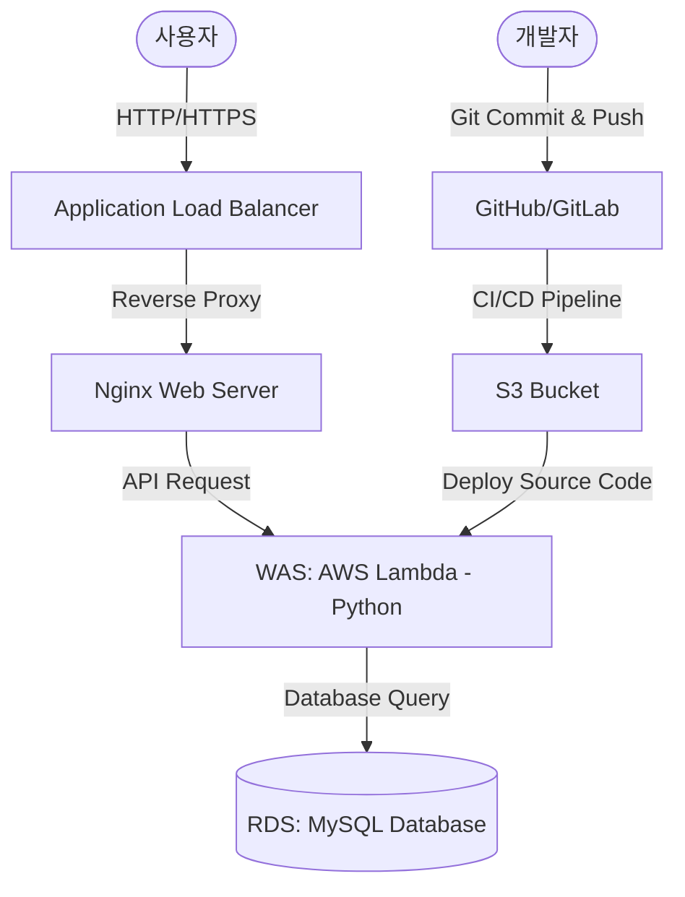

# User Management System (AWS Lambda 3-Tier Architecture)

이 프로젝트는 AWS Lambda를 웹 애플리케이션 서버(WAS)로 사용하고, ALB(Application Load Balancer)와 Nginx를 거쳐 RDS(MySQL)에 연결되는 3-tier 구조의 초간단 사용자 회원가입/로그인 웹 애플리케이션입니다.

---

## 🏛️ 아키텍처 구조 (3-Tier Architecture)

### ⚙️ 배포 및 인프라 흐름
1. **코드 배포**: 개발자가 코드를 Git에 Commit하면, CI/CD 파이프라인을 거쳐 S3 버킷으로 배포용 zip 파일이 업로드됩니다.
2. **인프라 생성**: 사용자가 Terraform 코드를 사용하여 전체 인프라를 생성합니다.
3. **람다 생성**: WAS 역할을 담당할 AWS Lambda 함수는 S3에 업로드된 최신 코드를 참조하여 자동으로 생성/갱신됩니다.

---

## 💻 서비스 동작 구조 및 요구사항

**주제**: 간단한 사용자 회원가입 및 로그인 관리 기능

### 1. 로그인 & 회원가입
- **회원가입**: 이메일 주소와 비밀번호를 입력받아 새로운 회원을 등록합니다.
- **로그인**: 이메일 주소와 비밀번호(최소 6자리)로 인증을 수행합니다.
  - **일반 회원** 로그인 성공 시: **A창 (회원 정보 화면)**으로 진입합니다.
  - **관리자(admin)** 로그인 성공 시: **B창 (관리자 관리 화면)**으로 진입합니다.

### 2. 로그인 이후 화면 구성
- **일반 회원 화면 (A창)**: 본인의 이메일 주소와 가입 날짜 정보를 표 형태로 시각화하여 확인합니다.
- **관리자 화면 (B창)**: 전체 가입된 회원들의 목록 테이블을 조회합니다.
  
| 이메일 주소 | 가입 날짜 | 최근 로그인 날짜 |
| :--- | :--- | :--- |
| `admin@example.com` | `2026-07-01` | `2026-07-06` |
| `user1@mail.com` | `2026-07-02` | `2026-07-05` |

---

## 🛠️ 구현 기술 스택

- **Frontend**: Single Page Application (HTML, Vanilla CSS, JS Fetch API)
- **Backend WAS**: AWS Lambda용 Python 3.x
- **Database**: RDS MySQL (로컬 테스트 시 SQLite 호환 모드 제공)
- **작업 디렉토리**: 모든 소스 코드는 `/lambda-app` 내에 구성합니다.
